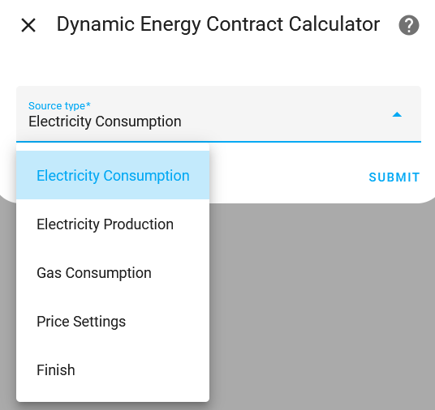
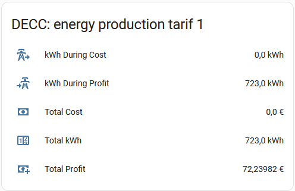

# Dynamic Energy Contract Calculator

This Home Assistant custom integration adds utility sensors that calculate electricity or gas costs using current pricing information. It can track consumption or production and provides several helpers to manage the sensors.


## Installation

1. **Via [HACS](https://hacs.xyz/):**
   - Add this repository as a custom integration in HACS.
   - Install **Dynamic Energy Contract Calculator** from the HACS list of integrations.
   - Restart Home Assistant to load the integration.

2. **Manual installation:**
   - Copy the `dynamic_energy_contract_calculator` folder from `custom_components` into your Home Assistant `custom_components` directory.
   - Restart Home Assistant.

## Configuration

1. In Home Assistant navigate to **Settings → Devices & Services** and use **Add Integration**.
2. Search for **Dynamic Energy Contract Calculator** and follow the setup flow.
3. Select the energy sensors you want to track and provide an optional price sensor for live pricing.
4. Optionally configure price settings such as markup and tax values.

Price settings can be changed later from the integration's options flow. See
the *Price Settings* section below for all available keys.

### Installation parameters

During setup you will be asked for the following information:

1. **Source type** – choose whether the selected sensors measure electricity
   consumption, electricity production or gas consumption.
2. **Energy sensors** – one or more sensors with the `energy` or `gas` device
   class that provide cumulative readings.
3. **Price sensor** – optional sensor that provides the current energy price
   in €/kWh or €/m³.
4. **Price settings** – values from the table below used to calculate the final
   price.

See the [Home Assistant configuration documentation](https://www.home-assistant.io/docs/configuration/integrations/) for general details on adding custom integrations.

## Provided Sensors

For each configured source the integration creates the following sensors:

- `..._kwh_total` – total energy used/produced in kWh
- `..._cost_total` – accumulated cost in euro
- `..._profit_total` – accumulated profit in euro
- `..._kwh_during_cost_total` – kWh measured when the price is positive
- `..._kwh_during_profit_total` – kWh measured when the price is negative

In addition a few summary sensors are created:

- `sensor.electricity_contract_fixed_costs_total`
- `sensor.gas_contract_fixed_costs_total`
- `sensor.net_energy_cost_total`
- `sensor.energy_contract_cost_total`
- `sensor.current_consumption_price`
- `sensor.current_production_price`
- `sensor.current_gas_consumption_price`

These sensors can be used in the [Energy dashboard](https://www.home-assistant.io/docs/energy/) or in your own automations.

## Services

The integration exposes several services under the `dynamic_energy_contract_calculator` domain:

- `reset_all_meters` – reset all dynamic energy sensors to `0`
- `reset_selected_meters` – reset only the specified sensors
- `set_meter_value` – manually set the value of a sensor


Each service is documented in Home Assistant once the integration is installed. See the [service documentation](https://www.home-assistant.io/docs/scripts/service-calls/) for details on calling services.

## Supported Devices / Functions

The integration works with any energy or gas sensor that provides cumulative kWh or m³ readings. A price sensor is optional but allows for true dynamic pricing. Available services are:

- `reset_all_meters`
- `reset_selected_meters`
- `set_meter_value`

## Usage

Add the created sensors to your dashboards or use them in automations to keep
track of real-time energy costs. The integration provides several services (see
the *Services* section below) that can be called from automations or scripts to
reset meters or manually set a value.

## Use Cases

- Monitor day-to-day electricity and gas costs in the Energy dashboard.
- Compare consumption and production prices to determine when selling back to the grid is profitable.
- Combine the summary sensors in automations to keep track of monthly spending or trigger notifications when costs rise above a threshold.

## Examples

### Notify when daily cost exceeds €5

```yaml
alias: "Notify high daily cost"
trigger:
  - platform: numeric_state
    entity_id: sensor.energy_contract_cost_total
    above: 5
action:
  - service: notify.mobile_app_phone
    data:
      message: "Your energy usage exceeded €5 today."
```

### Reset all meters on the first day of the month

```yaml
alias: "Monthly meter reset"
trigger:
  - platform: time
    at: "00:00:00"
condition:
  - condition: template
    value_template: "{{ now().day == 1 }}"
action:
  - service: dynamic_energy_contract_calculator.reset_all_meters
```

## Price Settings

During configuration you can adjust several price related options. These values
are split into costs per kWh/m³ or per day and are further divided by
government, grid operator and supplier charges. All values are added on top of
the base price from your price sensor before VAT is calculated.

| Setting | Description |
| ------- | ----------- |
| `per_unit_supplier_electricity_markup` | Additional cost per kWh for electricity consumption. |
| `per_unit_supplier_electricity_production_markup` | Additional revenue per kWh for produced electricity. |
| `per_unit_government_electricity_tax` | Government tax per kWh for consumption. |
| `per_day_grid_operator_electricity_connection_fee` | Daily electricity network fees. |
| `per_day_supplier_electricity_standing_charge` | Fixed daily cost charged by your supplier. |
| `per_day_government_electricity_tax_rebate` | Daily rebate applied to reduce fixed costs. |
| `per_unit_supplier_gas_markup` | Additional cost per cubic meter of gas. |
| `per_unit_government_gas_tax` | Government tax per cubic meter of gas. |
| `per_day_grid_operator_gas_connection_fee` | Daily gas connection fees. |
| `per_day_supplier_gas_standing_charge` | Fixed daily gas contract cost. |
| `vat_percentage` | VAT rate that should be applied to all calculated prices. |

If your price sensors already provide prices **including** VAT, set
`vat_percentage` to `0` to avoid double counting.

### Configuration parameters

All of the parameters above can be changed later from the integration's options
flow. You can also modify the list of energy sensors or change the selected
price sensor at any time via **Settings → Devices & Services**.

## How Calculations Work

For every update of an energy sensor the integration calculates the change
since the previous update. This delta is multiplied by a price that depends on
the selected source type and the configured price settings.

### Consumption

Electricity consumption uses the formula:

```
price = (
    base_price
    + per_unit_supplier_electricity_markup
    + per_unit_government_electricity_tax
) * (1 + vat_percentage / 100)
```

Gas consumption uses:

```
price = (
    base_price
    + per_unit_supplier_gas_markup
    + per_unit_government_gas_tax
) * (1 + vat_percentage / 100)
```

### Production

For production sensors the supplier markup is subtracted. Depending on the
`production_price_include_vat` option VAT may or may not be applied:

```
if production_price_include_vat:
    price = (
        base_price
        - per_unit_supplier_electricity_production_markup
    ) * (1 + vat_percentage / 100)
else:
    price = base_price - per_unit_supplier_electricity_production_markup
```

The resulting price is multiplied by the energy delta (kWh or m³) and added to
the appropriate cost or profit sensor.

### Daily costs

Once per day at midnight fixed contract costs are added:

```
electricity_daily = (
    per_day_grid_operator_electricity_connection_fee
    + per_day_supplier_electricity_standing_charge
    - per_day_government_electricity_tax_rebate
) * (1 + vat_percentage / 100)

gas_daily = (
    per_day_grid_operator_gas_connection_fee
    + per_day_supplier_gas_standing_charge
) * (1 + vat_percentage / 100)
```

## Data Update

Dynamic sensors update whenever the linked energy sensor or price sensor changes. The integration listens for state changes, so updates happen immediately without polling. Daily cost sensors add their values at midnight using Home Assistant's scheduler.

## Troubleshooting

- **No sensors created:** check the Home Assistant logs for setup errors and
  verify that your energy sensors are selected during configuration.
- **Prices remain at 0:** ensure a valid price sensor is configured or manually
  set one in the options flow.
- **Resetting values:** use the `reset_all_meters` or `reset_selected_meters`
  services if the readings get out of sync.
- **Sensors unavailable:** if a sensor shows `unavailable`, verify the source and price sensors still report valid numeric values.
- **Negative totals:** make sure production sensors are configured with the correct source type so that profits and costs are calculated properly.

## VAT and feed‑in

Most energy suppliers display prices including 21&nbsp;% VAT. By default the
integration assumes prices *excluding* VAT and adds the configured VAT
percentage. If your price sensor already provides a price that includes VAT,
set `vat_percentage` to `0`.

Private solar panel owners do not need to pay VAT on electricity fed back to the
grid. The supplier includes VAT in the compensation you receive. To track your
income you can therefore use the same settings as for consumption: make sure the
entered tariff matches the amount you receive from the supplier (with or without
VAT) and adjust `vat_percentage` accordingly.

## Known Limitations

- No support for the Dutch net metering (saldering) scheme. Feed‑in energy is compensated at the current rate and not offset against prior consumption.
- The integration relies on cumulative energy sensors. If a sensor resets unexpectedly the calculated totals may become inaccurate.
- Prices are taken from your own sensor; the integration does not fetch tariffs from suppliers.

## Example configuration

Below are screenshots from a typical installation that show the most important
steps of the setup flow. 

### 1. Start the configuration flow



The **Add integration** dialog lists *Dynamic Energy Contract Calculator*. After
selecting it you will be guided through a short setup wizard.

### 2. Choose which sensors to track


Here you select the energy sensors that should be monitored. You can choose
consumption, production or gas sensors. Optionally select a price sensor that
provides the current tariff.

### 3. Configure price settings


This screen lets you configure markups, surcharges and VAT. The values are added
on top of the base price reported by your price sensor.

The example above is based on a ANWB Dynamic Contract, with Enexis as grid operator and tax settings according to 2025 with gas consumption <500m3 per year and electricity <10.000kWh per year.

### 4. Resulting sensors




After finishing the wizard the integration creates individual sensors for each
source as well as summary sensors that combine the totals.

## Removal

To remove the integration open **Settings → Devices & Services**, locate
**Dynamic Energy Contract Calculator**, choose **Delete** from the menu and
confirm. All created sensors will be removed from Home Assistant.

## Output Sensor Calculations

Each output sensor derives its values from the selected input sensors and the configured price settings.

### `..._kwh_total` / `..._m3_total`
For every update of the linked energy sensor the integration calculates the delta since the previous reading and adds it to these totals.

### `..._cost_total`
The energy delta is multiplied by the current tariff. The tariff consists of the base price from your price sensor plus supplier markups and taxes, optionally including VAT.

### `..._profit_total`
For production sources positive prices are treated as profit while negative prices count as cost. This sensor accumulates those profit values.

### `..._kwh_during_cost_total`
Tracks how much energy was measured while the calculated price was above zero.

### `..._kwh_during_profit_total`
Tracks energy measured while the calculated price was below zero.

### Contract fixed cost sensors
`electricity_contract_fixed_costs_total` and `gas_contract_fixed_costs_total` add their respective daily fees at midnight.

### Net and total cost sensors
`net_energy_cost_total` subtracts accumulated profit from accumulated cost. `energy_contract_cost_total` combines the net cost with both fixed cost sensors.

### Current price sensors
`current_consumption_price`, `current_production_price` and `current_gas_consumption_price` show the instantaneous tariff based on the price sensor and all configured markups and taxes.

